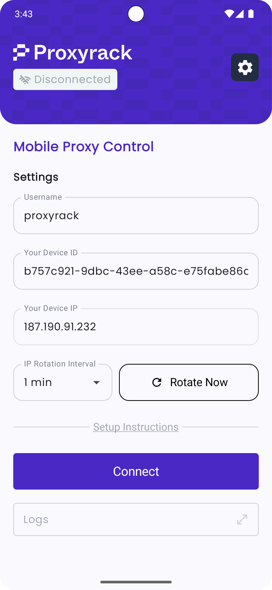

## Proxyrack Mobile Proxy Client

**Proxyrack Mobile Proxy Client** is a free and powerful solution for creating and managing mobile proxies directly from your mobile devices. Similar to **Proxidize** and **iProxy**, this app allows you to turn your device into a mobile proxy with minimal setup, offering both HTTP and SOCKS protocols for secure, reliable connections. With a user-friendly web dashboard, you can monitor and manage all connected devices with ease.

<div style="display: flex; justify-content: center;">
  
</div>

## Key Features

- **HTTP and SOCKS Protocols**: Choose your preferred protocol to match your application requirements.
- **Completely Free**: Enjoy unlimited access to all features at no cost.
- **Easy Setup**: Get up and running in under 2 minutes, with minimal configuration needed.
- **Web Dashboard**: View and manage all connected devices from a single, intuitive interface.
- **Location Flexibility**: Connect from various locations worldwide, ideal for bypassing geo-restrictions and enhancing privacy.

## Getting Started

Download the precompiled APK from the [releases page](https://github.com/proxyrack/mobile-proxy-android/releases)
or build it yourself using the instructions below.

## How to build
1. Clone the repository:
    ```bash
    git clone https://github.com/proxyrack/mobile-proxy-android.git
    ```
1. Run the script 'build.sh'
2. The generated apk will be in the path ./app/build/outputs/apk/release/app-release.apk

## Usage

**Proxyrack Mobile Proxy Client** is perfect for:

- Secure web browsing with HTTP and SOCKS protocols
- Accessing geo-restricted content with location-targeted IPs
- Social media management with multiple IPs
- Privacy-focused web scraping and data gathering

---

For more information, check out https://www.proxyrack.com/mobile-proxy/ or contact us at [support@proxyrack.com](mailto:support@proxyrack.com).
